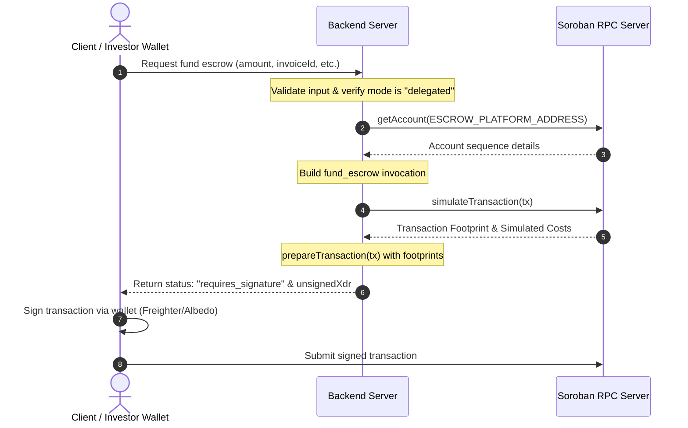
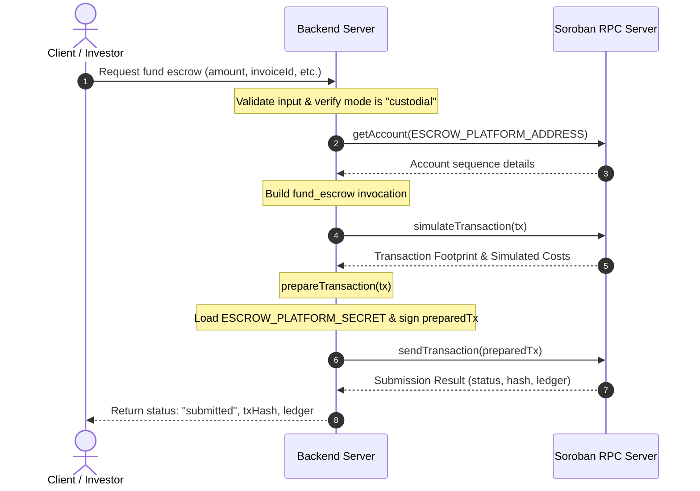
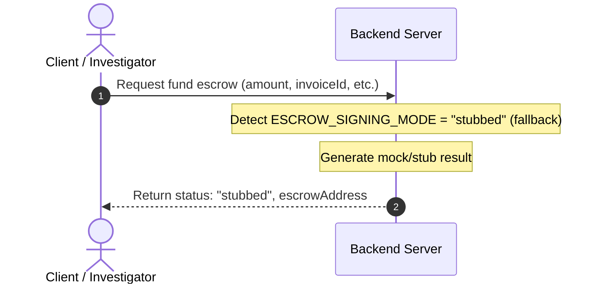

# Escrow Transaction Signing Modes

This document defines the server-orchestrated signing interface and behaviors for Soroban escrow funding using the LiquifactEscrow contract. The system supports three execution/signing modes: **Delegated**, **Custodial**, and **Stubbed**, which are controlled via the `ESCROW_SIGNING_MODE` environment variable.

---

## Environment Variables

The escrow submission module consumes the following environment variables:

| Variable | Required in Mode | Description |
| --- | --- | --- |
| `ESCROW_SIGNING_MODE` | All Modes | `"delegated" \| "custodial" \| "stubbed"` (default: `stubbed`). |
| `SOROBAN_RPC_URL` | Delegated, Custodial | The endpoint of the Soroban RPC server (e.g., `https://soroban-testnet.stellar.org`). |
| `STELLAR_NETWORK_PASSPHRASE` | Delegated, Custodial | Passphrase matching the target Stellar network (configured automatically at boot). |
| `ESCROW_PLATFORM_ADDRESS` | Delegated, Custodial | The Stellar public key of the platform account used as the transaction source. |
| `ESCROW_PLATFORM_SECRET` | Custodial Only | The secret key of the platform account. Highly sensitive; only loaded dynamically in-memory during signature execution. |

---

## Runtime Modes

### 1. Delegated Mode (`delegated`)
*   **Status:** `requires_signature`
*   **Overview:** Builds the unsigned `fund_escrow` Soroban contract transaction, performs simulation to populate the required ledger footprint, prepares the transaction, and returns the unsigned XDR string to the client.
*   **Execution Flow:**
    1.  The client invokes the funding endpoint.
    2.  The backend server builds the `fund_escrow` transaction sequence with `ESCROW_PLATFORM_ADDRESS` as the source account.
    3.  The server simulates the transaction against the Soroban RPC endpoint to populate fee and transaction footprints.
    4.  The server returns the unsigned prepared transaction XDR to the client.
    5.  The client-side wallet (e.g., Freighter, Albedo) signs and broadcasts the transaction independently.

### 2. Custodial Mode (`custodial`)
*   **Status:** `submitted`
*   **Overview:** The backend server orchestrates transaction creation, footprint preparation, in-memory signing with the platform secret key (`ESCROW_PLATFORM_SECRET`), and direct submission to the Soroban RPC network.
*   **Execution Flow:**
    1.  The client invokes the funding endpoint.
    2.  The server builds and simulates the `fund_escrow` transaction identically to delegated mode.
    3.  The server dynamically loads `ESCROW_PLATFORM_SECRET` into memory to instantiate a temporary `Keypair`.
    4.  The server signs the prepared transaction and transmits it directly to the Soroban RPC.
    5.  Returns the status `submitted`, transaction hash (`txHash`), and the submission ledger to the client.

### 3. Stubbed Mode (`stubbed`)
*   **Status:** `stubbed`
*   **Overview:** A test and staging fallback mode. It completely bypasses all Soroban RPC calls, cryptographic operations, and platform address/secret requirements.
*   **Execution Flow:**
    1.  The client invokes the funding endpoint.
    2.  The server detects that `ESCROW_SIGNING_MODE` is set to `stubbed` (or undefined).
    3.  The server immediately returns a deterministic mock/stub response indicating success in a mock environment.

---

## Mermaid Sequence Diagrams

### Delegated Mode Flow

### Custodial Mode Flow

### Stubbed Mode Flow

